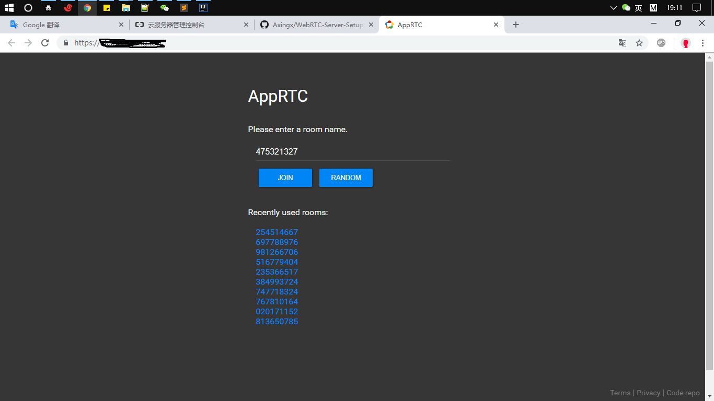
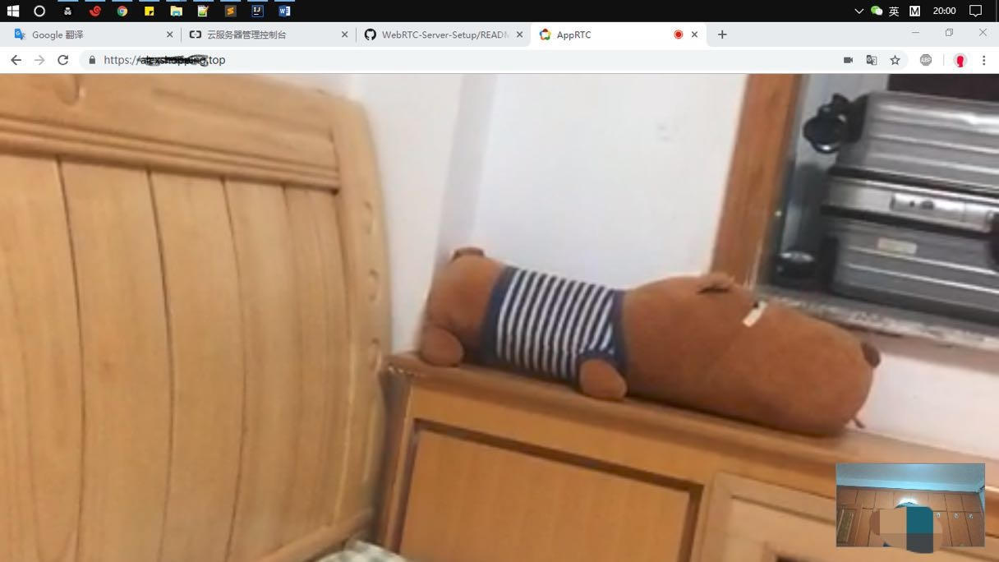

# 阿里云服务器上搭建WebRTC教程
网页即时通信（Web Real-Time Communication），是一个支持网页浏览器进行实时语音对话或视频对话的API，一共需要搭建三个服务器

房间服务器，信令服务器，内网穿透服务器
	
🏀🏀🏀🏀🏀🏀🏀🏀🏀🏀🏀🏀🏀🏀🏀🏀🏀🏀🏀🏀🏀🏀🏀🏀🏀🏀🏀

### 房间服务器(appRTC):

开源实现: [github.com/webrtc/apprtc](url)

房间服务器是用来创建和管理通话会话的状态维护,是通话还是多方通话,加入与离开房间等等

### 信令服务器(collider):

信令就是为了建立一个webRTC的通讯过程，客户端需要交换如下信息

1. 会话控制信息，用来开始和结束通话，即开始视频、结束视频这些操作指令。
2. 发生错误时用来相互通告的消息
3. 元数据，如各自的音视频解码方式、带宽。
4. 网络数据，对方的公网IP、端口、内网IP及端口。

### 内网穿透服务器

开源实现: [github.com/coturn/coturn](url)

内网穿透即NAT穿透，网络连接时术语，计算机是局域网内时，外网与内网的计算机节点需要连接通信，有时就会出现不支持内网穿透。
就是说映射端口,能让外网的电脑找到处于内网的电脑,提高下载速度。
不管是内网穿透还是其他类型的网络穿透，都是网络穿透的统一方法来研究和解决。
NAT穿透，nat穿透中有关于网络穿透的详细信息。WebRTC 可以使用ICE框架去克服真实世界的复杂网络。

STUN (Simple Traversal of UDP Through NAT)，是一个完整的NAT穿透解决方案，即简单的用UDP穿透NAT。
​	

TURN (Traversal Using Relay NAT), 与STUN一样为了完成穿透效果，但是TURN是通过转发的方式来实现穿透。
​	

ICE (Interactive Connectivity Establishment), 综合以上2种协议的综合性NAT穿越解决方案。首先会尝试用设备系统或网卡获取到的主机地址去建立连接；如果这个失败了（设备在NATs后面就会）ICE从STUN服务器获得外部的地址，如果这个也失败了，就用TURN中转服务器做通讯。

**WARNING**

请开放你的防火墙端口8080、8089、3478、80、443

下面的安装过程需要**git**、**wget**请自行安装

### 安装Git依赖🌋
	sudo yum install -y make auomake gcc cc gcc-c++ wget
	sudo yum -y install zlib-devel openssl-devel cpio expat-devel gettext-devel curl-devel perl-ExtUtils-CBuilder perl-ExtUtils-MakeMaker
    wget git.tar.gz
    tar -zxvf git.tar.gz
    cd git.tar.gz
    sudo make prefix=/usr/local all
    sudo make prefix=/usr/local install
    sudo yum install git

### 一、APPRTC安装🚩

安装依赖程序根据自身情况,考虑是否适用sudo

    sudo yum install ant

    sudo yum install -y nodejs

    sudo yum install npm

    sudo npm -g install grunt-cli

我一般将下载的项目放在/usr/local/soft/下

    1. git clone https://github.com/webrtc/apprtc
    2. cd apprtc
    3. 下载Google App Engine SDK到apprtc目录
    4. 设置Google App Engine SDK的环境变量：export PATH=$PATH:/usr/local/soft/apprtc/google_appengine
    5. sudo npm install
    6. sudo grunt build
    7. dev_appserver.py --host ip ./out/app_engine/

### 二、COLLIDER安装

    1. mkdir collider
    2. cp -r apprtc/src/collider collider/src(apprtc项目里有collider,将它拷贝到根目录下的collider/src)
    3. export COLLIDER_ROOT=$HOME/collider

由于collider信令服务器是用go语言写的,所以我们需要搭建go环境

    go语言安装

    4.wget https://dl.google.com/go/go1.11.4.linux-amd64.tar.gz

    5.tar -C /usr/local -xzf go1.4.linux-amd64.tar.gz

    6. 进入到步骤1创建的collider/src目录 go get collidermain

    7. go install collidermain

注意：安装出现的错误（go get报错unrecognized import path “golang.org/x/net/context”）
	
	$mkdir -p $GOPATH/src/golang.org/x/
	$cd $GOPATH/src/golang.org/x/
	$git clone https://github.com/golang/net.git net 
	$go install net
	
    不出意外的话会在collider目录下生成out目录,里面有collidermain运行命令

### 三、COTURN安装

    1.wget http://turnserver.open-sys.org/downloads/v4.5.0.5/turnserver-4.5.0.5-CentOS7.2-x86_64.tar.gz

    2.安装turnserver依赖 libevent
    
     wget http://coturn.net/turnserver/v4.5.0.7/turnserver-4.5.0.7.tar.gz
     tar xvf libevent-2.0.21-stable.tar.gz
     cd libevent-2.0.21-stable
     ./configure
     make install
   
    3.安装turnserver
    ./configure make make install

配置 turnserver.conf

	cd /usr/local/etc
	sudo cp turnserver.conf.default turnserver.conf
	sudo vim turnserver.conf

配置如下信息
	
 	listening-device=eth0
	listening-port=3478
	tls-listening-port=5349
	min-port=59000
	max-port=65000
	Verbose
	fingerprint
	lt-cred-mech
	use-auth-secret
	static-auth-secret=hechao
	realm=<hechao>
	user=hechao:0x4a5bb70f7a87322fec2920bd24679891
	user=hechao:123456
	stale-nonce
	cert=/etc/turn_server_cert.pem
	pkey=/etc/turn_server_pkey.pem
	no-loopback-peers
	no-multicast-peers
	mobility
	no-cli

生成md5码：turnadmin -k –u 用户名 -r 密钥 -p 密码

    修改static-auth-secret=yourname realm=<yourname>
    user=name:0xe89026fdb3ecba762464df471f383559
    user=name:password

用Openssl命令生成上面cert和pkey配置的自签名证书：

    sudo openssl req -x509 -newkey rsa:2048 -keyout   /etc/turn_server_pkey.pem -out /etc/turn_server_cert.pem -days 99999 -nodes

启动打洞穿透服务：turnserver -v /usr/local/etc/turnserver.conf

### 四、配置信令和房间服务器🎉🐱‍🏍

    进入到步骤二、创建的collider目录下
    cd collider/src/collider/collidermain
    sudo vim main.go

    设置服务器地址和ip（将127.0.0.1替换为你的服务器ip）：

    var roomSrv = flag.String("room-server", "https://外网ip:8080", "The origin of the room server")

    切换到apprtc目录，修改房间服务器相关配置

编辑constants.py

    ICE_SERVER_OVERRIDE  = [  
    {
   	
    'urls': [ 
    	"turn:内外ip:3478?transport=udp",
       	"turn:内外ip:3478?transport=tcp"
     ],
     "username": "turnadmin生成的name",
     "credential": "turnadmin生成的密钥"
    },
    {
     "urls": [
       "stun:内网:3478"
     ]
    }
    ]

    ICE_SERVER_BASE_URL = 'https://alexshopping.top'
    ICE_SERVER_URL_TEMPLATE = '%s/v1alpha/iceconfig?key=%s'
    ICE_SERVER_API_KEY = os.environ.get('ICE_SERVER_API_KEY')

    WSS_INSTANCE_HOST_KEY = '外网ip:8089'
    WSS_INSTANCE_NAME_KEY = 'vm_name'
    WSS_INSTANCE_ZONE_KEY = 'zone'
    WSS_INSTANCES = [{
        WSS_INSTANCE_HOST_KEY: '外网ip:8089',
        WSS_INSTANCE_NAME_KEY: 'wsserver-std',
        WSS_INSTANCE_ZONE_KEY: 'us-central1-a'
    },{
        WSS_INSTANCE_HOST_KEY: '外网ip:8089',
        WSS_INSTANCE_NAME_KEY: 'wsserver-std-2',
        WSS_INSTANCE_ZONE_KEY: 'us-central1-f'
    }]

编辑apprtc.py

**如果你只是本地测试用的话使用这份**

    def get_wss_parameters(request):
      ws_host_port_pair = request.get('wshpp')
      ws_tls = request.get('wstls')
    
      if not ws_host_port_pair:
        memcache_client = memcache.Client()
        ws_active_host = memcache_client.get(constants.WSS_HOST_ACTIVE_HOST_KEY)
        if ws_active_host in constants.WSS_HOST_PORT_PAIRS:
          ws_host_port_pair = ws_active_host
        else:
          logging.warning(
              'Invalid or no value returned from memcache, using fallback: '
              + json.dumps(ws_active_host))
          ws_host_port_pair = constants.WSS_HOST_PORT_PAIRS[0]
    
      if wss_tls and wss_tls == 'false':
        wss_url = 'ws://' + ws_host_port_pair + '/ws'
        wss_post_url = 'http://' + ws_host_port_pair
      else:
        wss_url = 'ws://' + ws_host_port_pair + '/ws'
        wss_post_url = 'http://' + ws_host_port_pair
      return (wss_url, wss_post_url)

**如果你有SSL证书使用这份**

    def get_wss_parameters(request):
      wss_host_port_pair = request.get('wshpp')
      wss_tls = request.get('wstls')
    
      if not wss_host_port_pair:
        # Attempt to get a wss server from the status provided by prober,
        # if that fails, use fallback value.
        #   wss_host_port_pair = constants.WSS_HOST_PORT_PAIR
        memcache_client = memcache.Client()
        wss_active_host = memcache_client.get(constants.WSS_HOST_ACTIVE_HOST_KEY)
        if wss_active_host in constants.WSS_HOST_PORT_PAIRS:
          wss_host_port_pair = wss_active_host
        else:
          logging.warning(
              'Invalid or no value returned from memcache, using fallback: '
              + json.dumps(wss_active_host))
          wss_host_port_pair = constants.WSS_HOST_PORT_PAIRS[0]
    
      if wss_tls and wss_tls == 'false':
        wss_url = 'ws://' + wss_host_port_pair + '/ws'
        wss_post_url = 'http://' + wss_host_port_pair
      else:
        wss_url = 'wss://' + wss_host_port_pair + '/ws'
        wss_post_url = 'https://' + wss_host_port_pair
      return (wss_url, wss_post_url)

启动apprtc服务器

    dev_appserver.py --enable_host_checking=false --host 内网ip(172.x.x.186) /usr/local/soft/apprtc/out/app_engine
    
    或者后台运行
    
    nohup dev_appserver.py --enable_host_checking=false --host 内网ip(172.x.x.186) /usr/local/soft/apprtc/out/app_engine/ &
    

所以都配置好后启动服务器

    dev_appserver.py --enable_host_checking=false --host 内网ip(172.x.x.186) /usr/local/soft/apprtc/out/app_engine

    cd /collider/bin/
    ./collidermain -port=8089 -tls=true
    
    cd /usr/local/soft/turnserver-4.5.0.7/bin
    ./turnserver -v /usr/local/etc/turnserver.conf
    
配置nginx

反向代理apprtc，使之支持https访问，如果http直接访问apprtc，则客户端无法启动视频音频采集（必须得用https访问）

    yum -y install nginx
    vim /etc/nginx/nginx.conf
    
    user nginx;
    worker_processes auto;
    error_log /var/log/nginx/error.log;
    pid /run/nginx.pid;
    
    include /usr/share/nginx/modules/*.conf;
    
    events {
        worker_connections 1024;
    }
    
    http {
        log_format  main  '$remote_addr - $remote_user [$time_local] "$request" '
                          '$status $body_bytes_sent "$http_referer" '
                          '"$http_user_agent" "$http_x_forwarded_for"';
    
        access_log  /var/log/nginx/access.log  main;
    
        sendfile            on;
        tcp_nopush          on;
        tcp_nodelay         on;
        keepalive_timeout   65;
        types_hash_max_size 2048;
    
        include             /etc/nginx/mime.types;
        default_type        application/octet-stream;
        
        upstream roomserver{
             server 47.x.x.61:8080;
             }
             server {
                 listen       80;
                 server_name  域名;
                 if ($scheme = http) {
                   return 301 https://$server_name$request_uri;
                }
                # location / {
                # }
        
                # error_page 404 /404.html;
                #     location = /40x.html {
                # }
        
                # error_page 500 502 503 504 /50x.html;
                #     location = /50x.html {
                # }
             }
             
        server {
                #listen       80;
                #listen       443 ssl http2 default_server;
                #listen       [::]:443 ssl http2 default_server;
                listen       443 ssl;
                root         /usr/share/nginx/html;
        
                ssl_certificate "/developer/key/alexshopping.top.pem";
                ssl_certificate_key "/developer/key/alexshopping.top.key";
                ssl_session_cache shared:SSL:1m;
                ssl_session_timeout  10m;
                ssl_ciphers HIGH:!aNULL:!MD5;
                ssl_prefer_server_ciphers on;
        
                location / {
                  proxy_pass http://roomserver$request_uri;
                  proxy_http_version 1.1;
                  proxy_set_header Upgrade $http_upgrade;
                  proxy_set_header Connection "upgrade";
                  proxy_set_header Host $host;
                }
            error_page 404 /404.html;
                        location = /40x.html {
                    }
            
                    error_page 500 502 503 504 /50x.html;
                        location = /50x.html {
                    }
                }
            }
            
重启nginx
            
     nginx -t
     nginx -s reload

如果你使用了非标准端口，或者使用路由器上的端口映射为广域网提供测试和服务，还需要修改WEB前端的一些代码。
否则会遇到浏览器的跨域访问问题（主要是 pushState 会产生一个错误），这么改

    cd /usr/local/soft/apprtc/src/web_app/js/appcontroller.js
        
    这个文件里有这样的两个函数：
    AppController.prototype.pushCallNavigation_
    AppController.prototype.displaySharingInfo_
        
    分别在这两行函数内部的开头，加上如下代码：
    roomLink = roomLink.replace(/apprtc\.domain\.com\//, 'apprtc.domain.com:8083/');
        
    保存退出

## License

本项目基于 MIT License 开源，详情请参见 [LICENSE](./LICENSE)。
